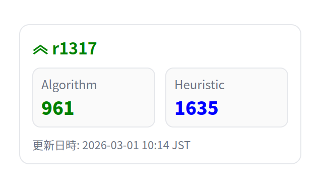

# AtCoder Rating Widget



## 概要

AtCoder のユーザーページから取得できる履歴 JSON を元に、ユーザーごとの「レーティング表示ウィジェット（HTML）」を自動生成します。

- HTML に埋め込み可能（`<object>` 等）
- Algorithm / Heuristic の両方に対応
- 毎週日曜日と月曜日の深夜(日本時間)に Gihub Actions でレーティングを自動更新

## 使い方

### 1. リポジトリをクローン

以下のコマンドでリポジトリをクローンしてください。
```bash
git clone https://github.com/r-1317/AtCoder-Rating-Widget.git
cd AtCoder-Rating-Widget
```
次に、GitHubにあなたのリモートリポジトリを作成してください。
upstream などの設定をしていただいても構いませんが、面倒な方は`.git/`ディレクトリを一度削除してから新たにリポジトリを初期化してください。

### 2. `users-list` を編集

`users-list` に、ウィジェットを生成したい AtCoder ユーザ名を改行区切りで記入します。

- 空行は無視されます
- `#` から始まる行はコメントとして無視されます

### 3. 手動で`generate_widgets.py`を実行 (初回のみ)
ローカル環境で`generate_widgets.py`を実行してください。

```bash
python3 generate_widgets.py
```

実行後、変更をコミットして GitHub に push してください。

#### 補足
`generate_widgets.py`はGitHub Actionsにて自動で実行されるようになっておりますので、 以後手動で実行する必要はございません。


### 4. GitHub Pages を有効化

GitHub のリポジトリ画面から、以下を設定します。

- Settings → Pages
- Build and deployment の Source を `Deploy from a branch` に設定
- Branch を `main` / `(root)` に設定して Save

（反映まで数分かかることがあります）

### 5. 埋め込み

生成されたウィジェットは GitHub Pages 上で配信されます。任意の HTML に、以下のように埋め込めます。

```html
<object data="https://{あなたのgithubユーザ名}.github.io/AtCoder-Rating-Widget/widgets/{AtCoderユーザ名}.html" type="text/html" width="320" height="140"></object>
```

## レーティングの更新について
何も操作する必要はございません。あなたがクローンしたリポジトリがGitHubに公開されているならば、更新は定期的に実行されるはずです。

## ライセンス

このソフトウェアは、[MIT License](./LICENSE) の下で配布されております。

